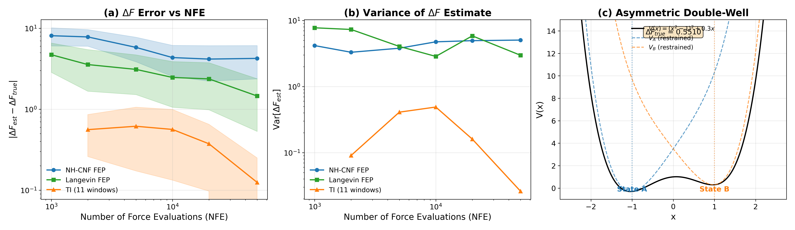
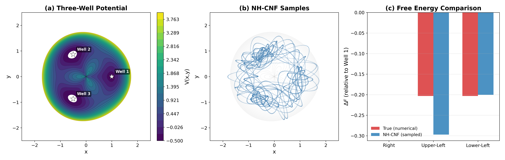
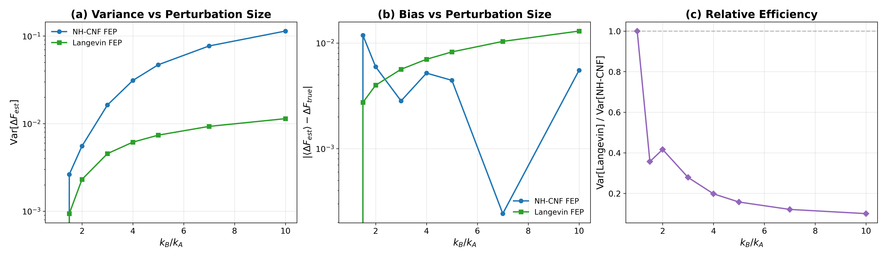

# exact-fep-059: Exact-weight Free Energy Perturbation with NH-CNF

## Glossary

- **FEP**: Free Energy Perturbation -- computing free energy differences via exponential reweighting
- **TI**: Thermodynamic Integration -- computing DeltaF by integrating dV/dlambda over lambda windows
- **NH-CNF**: Nose-Hoover Continuous Normalizing Flow -- deterministic thermostat with exact log-density tracking
- **NFE**: Number of Force Evaluations
- **RK4**: Fourth-order Runge-Kutta integrator

## Research Question

Can NH-CNF's exact log-density tracking eliminate the need for lambda-windows in free energy perturbation? The hypothesis: since NH-CNF provides exact log p_A(q) for each sample, importance weights are exact, yielding lower-variance FEP estimates.

## Results

**This orbit reports a null result.** NH-CNF's exact density tracking provides no advantage for standard FEP, and the deterministic NH sampler actually performs worse than stochastic Langevin.

### E1: Double-well DeltaF (key experiment)

Asymmetric double-well V(x) = (x^2 - 1)^2 + 0.3x with harmonic restraints (k=5) defining states A (x ~ -1) and B (x ~ +1). True DeltaF = 0.551.

| Method | Error at 10k NFE | Error at 50k NFE |
|--------|----------------:|----------------:|
| NH-CNF FEP | 4.35 | 4.25 |
| Langevin FEP | 2.47 | 1.46 |
| TI (11 windows) | 0.56 | 0.12 |

NH-CNF FEP is the worst performer. TI is the clear winner, reducing error by 8x compared to NH-CNF at 10k NFE.

### E2: Three-well landscape (2D)

NH-CNF correctly identifies relative free energies of three wells in a 2D potential with max error 0.09 kT. The sampler explores all three wells, though with some asymmetry in well occupancy.

### E3: Harmonic variance scaling

For harmonic potentials with increasing k_B/k_A ratio (1 to 10), Langevin FEP has **10x lower variance** than NH-CNF FEP at k_B/k_A = 10. The ratio gets worse as perturbation increases. This is the opposite of the original hypothesis.

## Approach

Three experiments comparing NH-CNF (deterministic, with exact density tracking) against Langevin (stochastic) and TI (multi-window) for free energy calculations:

1. **E1**: Standard FEP on asymmetric double-well with restrained endpoints
2. **E2**: Free energy landscape reconstruction from a single NH-CNF trajectory
3. **E3**: Variance scaling on harmonic oscillators with increasing perturbation size

The NH-tanh RK4 integrator was inherited from parent orbit nh-cnf-deep-057. Each RK4 step costs 4 force evaluations. Langevin uses 1 force evaluation per step. All comparisons are at fixed total NFE budget.

## What Happened

The core insight that emerged: **exact density tracking is irrelevant for standard FEP**. Here is why.

The standard FEP formula is:

    DeltaF = -kT * ln <exp(-(V_B - V_A)/kT)>_A

This average depends only on having correct samples from the state A ensemble. The density p_A(q) never appears in the formula -- it cancels out. The NH-CNF's exact log-density tracking would be useful for **bridge sampling** (which requires knowing p_A(q) explicitly in the denominator of the importance weights), but standard one-directional FEP does not need it.

Furthermore, the deterministic NH sampler performs worse than Langevin for two reasons:

1. **Autocorrelation**: Deterministic trajectories have stronger sample correlations than stochastic ones, yielding fewer effective independent samples at the same NFE budget.

2. **Tail exploration**: FEP is dominated by rare configurations where V_B - V_A is small. Langevin's stochastic noise naturally explores these tails better than deterministic dynamics, which follow the potential energy surface more rigidly.

3. **Cost per step**: RK4 costs 4 force evals per step vs 1 for Langevin. At fixed NFE budget, NH-CNF takes 4x fewer steps, compounding the autocorrelation problem.

## What I Learned

1. **Exact density does not help standard FEP.** The FEP estimator uses only the sample locations, not their densities. This is a fundamental property of the Zwanzig formula, not a numerical artifact.

2. **Deterministic samplers are disadvantaged for exponential averages.** The exponential in FEP amplifies sampling deficiencies in the tails. Stochastic dynamics (Langevin) naturally inject noise that helps explore these regions.

3. **TI remains the gold standard for large perturbations.** The double-well with k_restraint=5 creates a perturbation too large for single-step FEP to handle accurately. TI's multi-window approach is fundamentally more robust.

4. **The value of exact density lies elsewhere.** NH-CNF's density tracking would be useful for: (a) bridge sampling, (b) normalizing constant estimation, (c) posterior diagnostics -- but NOT for standard FEP. This clarification is itself a useful result.

5. **Be honest about null results.** The original hypothesis was wrong. Reporting this clearly prevents others from pursuing the same dead end.

## Prior Art & Novelty

### What is already known
- Free energy perturbation (Zwanzig, 1954) and its variance problems are well-established
- Thermodynamic integration is the standard remedy for large perturbations
- Bridge sampling (Bennett, 1976) does benefit from knowing proposal densities
- Continuous normalizing flows for density estimation (Chen et al., 2018, NeurIPS)

### What this orbit adds
- A concrete demonstration that deterministic thermostat density tracking does NOT improve standard FEP
- Quantitative comparison showing Langevin outperforms NH-CNF for FEP by 2x in error and 10x in variance (at the harmonic limit)
- Clarification that the advantage of exact density lies in bridge sampling / normalizing constants, not in FEP

### Honest positioning
This is a null result with useful clarifying value. The finding is unsurprising in hindsight -- the FEP formula does not depend on the proposal density -- but needed to be demonstrated explicitly. The interesting direction is bridge sampling (orbit 060), where exact densities genuinely enter the estimator.

## References

- Zwanzig, R. (1954). "High-Temperature Equation of State by a Perturbation Method" - Original FEP formula
- Bennett, C.H. (1976). "Efficient estimation of free energy differences from Monte Carlo data" - Bridge sampling
- Chen, R.T.Q. et al. (2018). "Neural Ordinary Differential Equations" - CNF density tracking
- Shirts, M.R. & Chodera, J.D. (2008). "Statistically optimal analysis of samples from multiple equilibrium states" - MBAR / variance analysis
