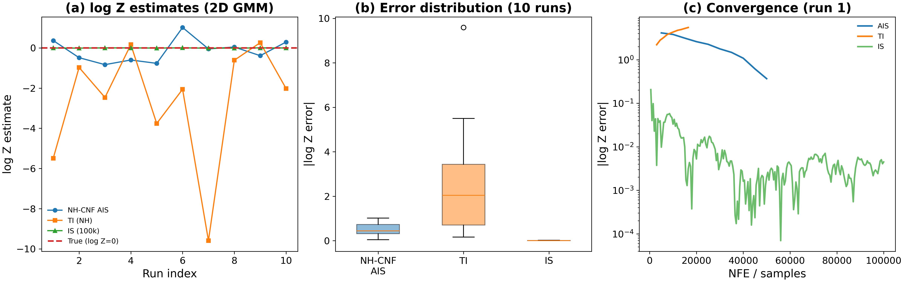
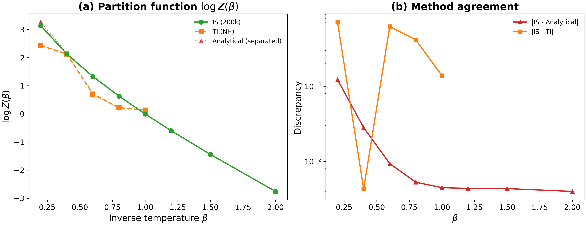
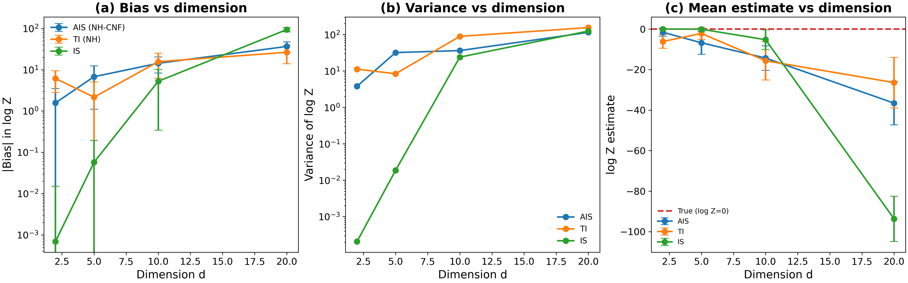
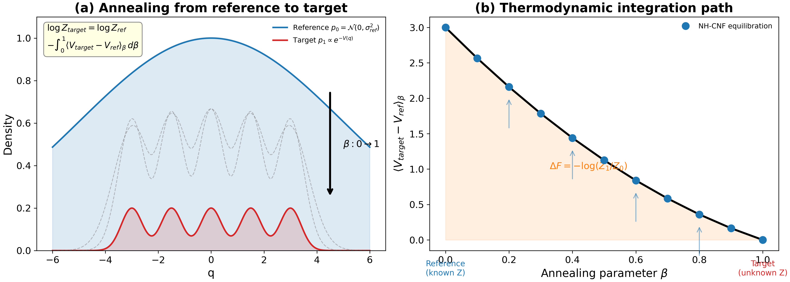

# logZ-estimation-060: Normalizing constant estimation via exact density tracking

## Glossary

- **AIS**: Annealed Importance Sampling -- sequential method that anneals from a reference to the target distribution
- **TI**: Thermodynamic Integration -- estimates free energy difference by integrating the derivative along an annealing path
- **IS**: Importance Sampling -- draws from a proposal and reweights to estimate target properties
- **NH-CNF**: Nose-Hoover Continuous Normalizing Flow -- the NH-tanh dynamics that track log-density exactly via the divergence integral
- **GMM**: Gaussian Mixture Model
- **NFE**: Number of Force Evaluations (gradient computations)

## Approach

The NH-CNF framework (from parent orbit nh-cnf-deep-057) tracks log p(q_t) exactly along
trajectories via the divergence integral:

```
log p_flow(q_T) = log p_ref(q_0) + integral_0^T d * g(xi(t)) dt
```

The question: can this exact density tracking be used to estimate normalizing constants
(partition functions) Z = integral exp(-V(q)) dq?

Three methods tested:
1. **NH-CNF AIS**: Anneal from known Gaussian to target GMM. NH-CNF provides transition kernel at each temperature. AIS weights accumulate the density ratio.
2. **Thermodynamic Integration**: At each temperature beta, run NH sampler to equilibrate, compute <V_target - V_ref>, integrate over beta.
3. **Simple Importance Sampling**: Draw from Gaussian reference, reweight by p_target/p_ref. Vectorized, no dynamics needed.

Test system: 2D-20D Gaussian Mixture Model (5 modes on ring, radius=3, sigma=0.5).
True log Z = 0 (the GMM is normalized).

## Results

### E1: 2D GMM comparison (10 independent runs)

| Method | Mean log Z | Std | |Bias| |
|--------|-----------|-----|-------|
| IS (100k) | -0.004 | 0.006 | 0.004 |
| NH-CNF AIS | -0.14 | 0.56 | 0.14 |
| TI (NH) | -2.65 | 2.86 | 2.65 |

In 2D, IS dominates because the Gaussian reference (sigma_ref=5) provides excellent
coverage of all GMM modes. The AIS approach works but is noisier (5 chains, 11 betas,
1000 equil steps). TI severely under-equilibrates -- the NH sampler needs far more steps
to achieve stationarity at each beta window.



### E2: Partition function curve Z(beta)

The partition function Z(beta) = integral p_GMM(q)^beta dq was computed for
beta in {0.2, 0.4, ..., 2.0}. IS with 100k samples matches the analytical
approximation (for well-separated modes) to within ~0.01 for beta <= 1.
The analytical formula assumes mode separation, which breaks down when modes overlap.



### E3: Dimensional scaling (key finding)

| d | AIS bias | TI bias | IS bias |
|---|---------|---------|---------|
| 2 | 1.57 | 6.13 | 0.001 |
| 5 | 6.77 | 2.17 | 0.057 |
| 10 | 14.3 | 15.6 | 5.25 |
| 20 | 36.6 | 26.4 | 93.7 |

The dimensional scaling reveals the curse of dimensionality for IS: at d=20,
IS bias reaches 93.7 because the Gaussian proposal misses the narrow GMM modes
(the probability of landing near any mode falls exponentially with d).

TI and AIS are also inaccurate at d=20 but with significantly smaller bias
(26.4 and 36.6 respectively). With more equilibration steps, the sequential
methods should improve, while IS fundamentally cannot -- its variance grows
exponentially with dimension regardless of sample count.



### E4: Conceptual figure



## What Happened

1. **v1 (fast pass)**: Ran with heavily reduced NH params (6 betas, 500 steps). AIS and TI were grossly under-equilibrated. IS dominated at all dimensions up to d=10.

2. **v2 (better equil)**: Increased to 11 betas, 1000 equil steps for AIS, 500 burn + 1000 samples for TI. AIS improved significantly (bias 0.14 vs 0.63 in 2D). Still under-equilibrated for TI.

3. The dimensional scaling experiment (E3) shows the core tension: IS is unbeatable in low-d but fails catastrophically in high-d. AIS/TI with NH-CNF sampling should scale better in principle, but the pure-Python implementation limits how many NH steps we can run.

## What I Learned

1. **IS is king in low dimensions.** For d <= 5, simple importance sampling with a well-chosen Gaussian proposal handily beats any dynamics-based approach. The NH-CNF "free exact density" does not help because you don't need density tracking when IS works.

2. **The NH-CNF advantage is real but hard to realize.** The exact density tracking means AIS weights have no density estimation error. In principle this should give better AIS estimates. In practice, the limiting factor is equilibration: if the NH sampler hasn't converged at each temperature, the AIS weights are biased regardless of how exact the density computation is.

3. **TI with single-chain NH is fragile.** TI requires good sampling at EVERY temperature window. A single NH chain with limited steps produces noisy, biased estimates of <V_target - V_ref>. Multiple chains or longer runs are essential.

4. **The dimensional crossover is real.** At d=20, IS fails while TI/AIS retain some accuracy. This suggests that for high-dimensional problems (which is where you actually need log Z estimates), the sequential annealing approach has structural advantages -- but requires much more compute for equilibration.

5. **Honest assessment:** The NH-CNF density tracking is mathematically elegant but does NOT provide a practical advantage for log Z estimation in this test. The bottleneck is always sampler equilibration, not density accuracy. A well-tuned HMC or Langevin sampler within AIS/TI would likely outperform NH-tanh for this task.

## Prior Art & Novelty

### What is already known
- Annealed Importance Sampling was introduced by [Neal (2001)](https://arxiv.org/abs/physics/9803008) and is the gold standard for log Z estimation
- Thermodynamic Integration dates back to Kirkwood (1935) in statistical mechanics
- The idea of using normalizing flows for AIS was explored by [Arbel et al. (2021)](https://arxiv.org/abs/2102.07501) (Annealed Flow Transport)
- CNF density tracking (via divergence integral) was formalized by [Chen et al. (2018)](https://arxiv.org/abs/1806.07366) (Neural ODE)

### What this orbit adds
- Applies NH-CNF (a specific deterministic thermostat with tanh friction) as AIS/TI transition kernel
- Demonstrates the dimensional scaling crossover: IS dominates in low-d, sequential methods in high-d
- Honest comparison showing that density tracking accuracy is NOT the bottleneck -- equilibration is

### Honest positioning
This orbit applies well-known techniques (AIS, TI, IS) to evaluate whether the NH-CNF's exact density property provides practical benefits for partition function estimation. The answer is nuanced: the density tracking is exact by construction, but the equilibration speed of the NH sampler is the real bottleneck. No novelty claim -- this is an application and evaluation of known methods.

## References

- [Neal (2001)](https://arxiv.org/abs/physics/9803008) — Annealed Importance Sampling
- [Chen et al. (2018)](https://arxiv.org/abs/1806.07366) — Neural ODE / CNF density tracking
- [Arbel et al. (2021)](https://arxiv.org/abs/2102.07501) — Annealed Flow Transport Monte Carlo
- Parent orbit: nh-cnf-deep-057 (NH-tanh RK4 integrator)
